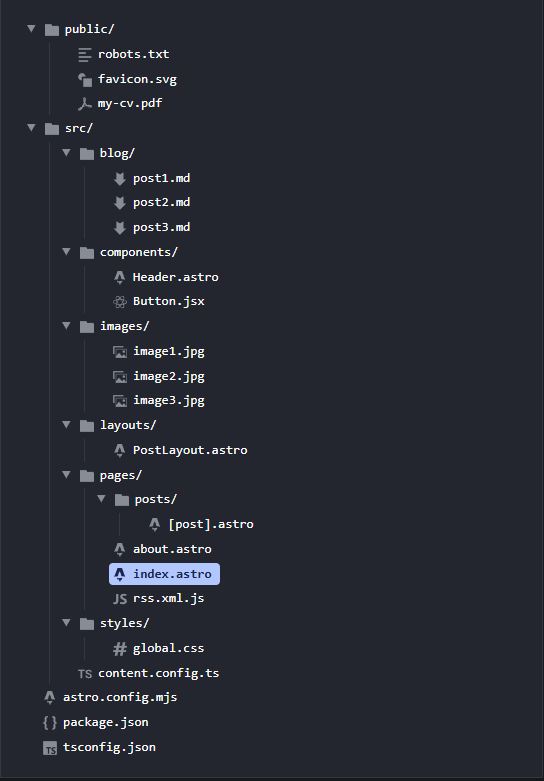

# Mi portfolio

**Tecnologías usadas**
- Astro

## Astro Docs

el portfolio está construido sobre Astro, con el propósito de aprender esta tecnología y aprovechar los beneficios que ofrece, tales como: 
- Su simplicidad

Al definirse como "un superconjunto de HTML" y cargar 0 JS por defecto, debería de ser fácil de dominar.
- Su eficiencia

Al ser 100% estático y depender inicialmente solo de HTML y CSS, cargarse del lado del servidor y justamente contar con 0 Javascript, "debería ser imposible construir un sitio web lento con Astro" y la complejidad es algo opcional. 
- Sus integraciones

Es compatible con otros Frameworks. Por ejemplo, en mi caso utilizo React por familiaridad, y acá lo  utilizaré para componentes dinámicos, ya sean visualmente o que requieran alguna intermediación con los datos o lógica. 

### Inicio > Arquitectura de islas

componente de interfaz de usuario mejorado en una página HTML, que tiene como particularidad el ejecutar el código JS del lado del cliente mediante la directiva `client:*`.

**isla del cliente:** componente de interfaz de usuario interactivo JS que se hidrata por separado del resto de la página. Ejemplo: elemento interactivo.
>**Hidratar**: tomar un HTML ya renderizado/cargado en el servidor y "conectarlo" con el Javascript en el cliente para hacerlo interactivo. Por ejemplo, un encabezado HTML interactivo y un carrusel de fotos se cargan en HTML en paralelo, pero se hidratan de forma aislada.

**isla del servidor:** componente de interfaz de usuario que renderiza en servidor su contenido dinámico por separado del resto de la página. Ejemplo: foto de perfil de un visitante conectado.
Así apartamos el código caro o lento del servidor del proceso principal de renderizado. 
Con la directiva `server:defer` lo convertimos en isla del servidor.


Ambas islas ejecutan procesos de forma independiente, por componente. Para optimizar la carga de las páginas. Gracias a esta independencia entre las islas es que Astro permite múltiples frameworks de UI como React, en una misma página. 

#### **Componente Estático ------------> isla**
`<MyReactComponent />` --> `<MyReactComponent client:load/>`

> Convertir cualquier componente de UI estático en una isla interactiva solo requiere una directiva `client:*`. Astro luego construye y empaqueta automáticamente tu JavaScript del lado del cliente para un rendimiento optimizado en el momento se se decida, dependiendo la directiva usada. 
Las directivas no reenvían todo el componente, sino el JS necesario para que el HTML ya renderizado se vuelva interactivo con el cliente.

**Aunque mis archivos .astro tengan código JS en frontmatter, si no tienen la directiva `client:*` el código se ejecuta en el servidor y el resultado se sigue transformando en HTML estático.**

Por lo tanto:
- No basta con que un script .astro tenga código JS para ser considerado isla.
- Si una isla tiene la directiva `client:*` pero no tiene código JS, igual se va a empaquetar y enviar al cliente ese commponente, pero al no recibir lógica interactiva, es como enviarle un "cascarón vacío" que se terminará comportando igual a que si fuera estático.  


|✅ Cuándo sí | Cuándo no ❌|
|---------|------|
| eventos del usuario | `<nav>` con links fijos |
| animaciones | `<footer>` con textos |
| APIs del navegador | `<p>` con texto  |
| componentes con estado dinámico | componentes puramente estáticos |

`client: idle`: el componente se carga cuando el navegador se vuelve inactivo.<br>
`client: visible`: el componente se carga cuando se ingresa al viewport.<br>
`client: load`: el componente se hidrata apenas la página termina de cargar.

### Inicio > Comienza un nuevo proyecto > Estructura de proyecto
Un proyecto de Astro común debería verse así:



`src/`  

Guarda el código fuente del proyecto.

`src/pages` 

Subdirectorio requerido por Astro. Almacena las rutas de las páginas que tendrá nuestro sitio. 

`src/components`

unidades reutilizables de código para tus páginas HTML. Pueden ser componentes de Astro o de un Framework como React.

`src/layouts`

estas plantillas son componentes de Astro que definen la estructura de la UI compartida por una o más páginas. Son como "megacomponentes" con el propósito de definir la estrucutra general (vista) de una página. Y dentro suyo se insertan otros componentes más pequeños que terminan de completar la vista.

`public/`

es para archivos del proyecto que no necesitan ser procesados durante la compliación final del mismo. Ideal para activos comunes que no requiren ningún procesamiento, como imágenes y fuentes. O archivos especiales.  

### Inicio > Configuración > Configuración overview

cómo personalizar el comportamiento de un proyecto Astro a través del archivo `astro.config.mjs`.

`astro.config.mjs` define las opciones globales de tu proyecto.

acá se definen opciones como:
- Directorio de salida (**outDir**).
- Directorio público (**publicDir**).
- URL base del sitio (**site**).
- integraciones (**integrations**).
Para agregar extensiones o librerías como Tailwind, React, etc.
- Adaptadores. Para definir dónde se va a desplegar el proyecto. 
- Opciones avanzadas. Configuración avanzada de Astro.

### Guía y Recetas > Enrutamiento y navegación > Páginas

son componentes de Astro en la carpeta `src/pages` responsables de manejar el enrutamiento, la carga de datos y el diseño general de cada página HTML del proyecto.

Compatibilidad con `.astro, .md, .mdx, .html, ([.js/.ts] como endpoints) `

#### link entre páginas
> Escribe HTML estándar elementos <a> en tus páginas Astro para enlazar a otras páginas en tu sitio. Ejemplo:

```html
Lee más <a href="/authors/sonali/">sobre Sonali</a>.
```

#### rutas estáticas

```
Example: Static routes

src/pages/index.astro        -> mysite.com/
src/pages/about.astro        -> mysite.com/about
src/pages/about/index.astro  -> mysite.com/about
src/pages/about/me.astro     -> mysite.com/about/me
src/pages/posts/1.md         -> mysite.com/posts/1
```

#### rutas edinámicas

```
Example: Dynamic routes

src/pages/authors/[author].astro
```

